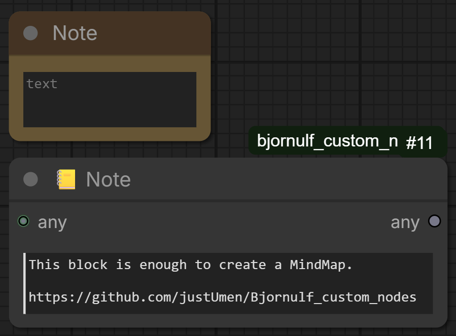
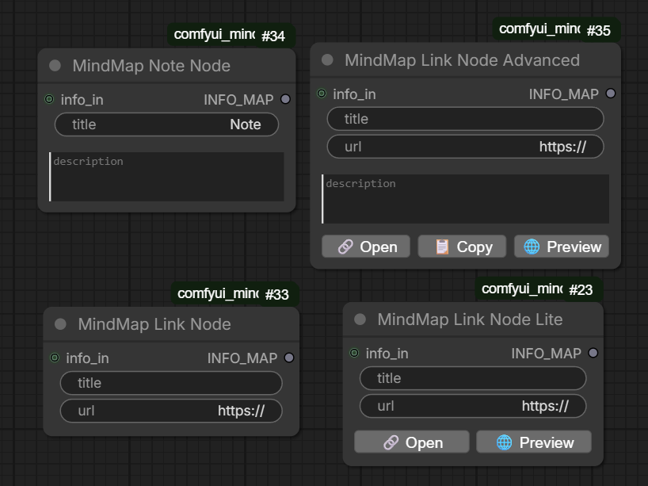
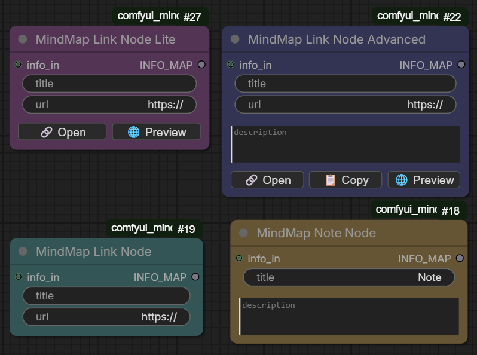
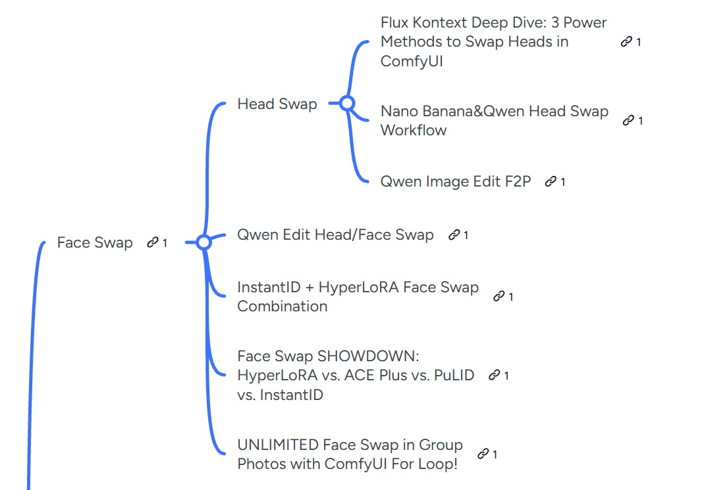
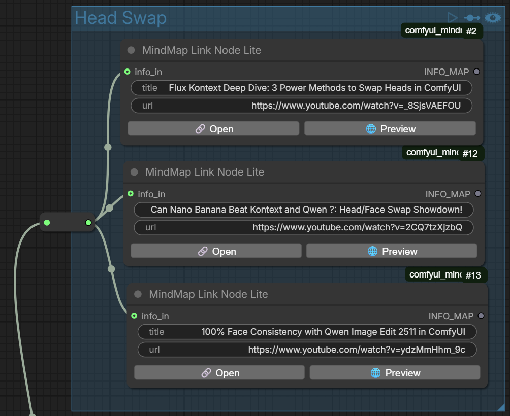
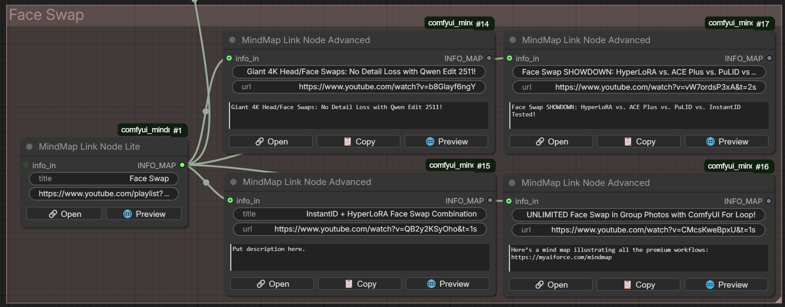

# MindMap ComfyUI (mental map)

MindMap nodes are used to build knowledge graphs within ComfyUI workflows.

This development was conceived as a universal way to build custom mind maps using ComfyUI. It is for informational purposes only and is not used for image generation.

Similar nodes already exist in ComfyUI. These are the note and comment nodes: Note (Comfy core), Note (Bjornulf_custom_nodes).
Bjornulf's Note is ideal for building simple graphs, as it has both input and output.

These MindMap nodes differ from existing ones in that they expand their capabilities.

## Example notes

 

## Nodes

- The **MindMap Note Node** has two separate fields: one for the title and one for the description.

- The **MindMap Link Node** has two fields for a short title and one for a link.

- **MindMap Link Node Lite** is an extended version of the previous node with two buttons - for following a link and previewing in a modal window.

- **MindMap Link Node Advanced** is an expanded version of the previous node with a description and a copy link button.





The key feature is a modal window with an image and description. The modal window scales synchronously with other nodes. For more information, use the mouse wheel.






## A personal suggestion

I also included example workflows (in the 'workflows' directory). 

## Installation

### Prerequisites

- ComfyUI installed and working

### Install the Node (manually)

1. Clone this repository to your ComfyUI custom nodes directory:
```bash
cd ComfyUI/custom_nodes/
git clone https://github.com/moonwhaler/comfyui-seedvr2-tilingupscaler.git
```

2. Install dependencies (outside of ComfyUI):

**IMPORTANT**: The requirements must be installed in the same Python environment that ComfyUI uses. This is typically a virtual environment (venv) or conda environment.

**For venv users:**
```bash
# Activate your ComfyUI virtual environment first
source /path/to/your/comfyui/venv/bin/activate  # Linux/Mac
# OR
/path/to/your/comfyui/venv/Scripts/activate  # Windows

# Then install requirements
cd UltimateResupscaler
pip install -r requirements.txt
```

**For conda users:**
```bash
# Activate your ComfyUI conda environment first
conda activate your-comfyui-environment

# Then install requirements
cd UltimateResupscaler
pip install -r requirements.txt
```

**For portable ComfyUI installations:**
```bash
# Use the Python executable from your ComfyUI installation
cd UltimateResupscaler
/path/to/ComfyUI/python_embeded/python.exe -m pip install -r requirements.txt  # Windows
# OR
/path/to/ComfyUI/python/bin/python -m pip install -r requirements.txt  # Linux/Mac
```

**Note**: These dependencies are often already installed in ComfyUI Windows Portable, and they may already be installed. They only affect the proxy server in a modal window. Check for them if you experience link preview errors.

3. Restart ComfyUI

The node will appear in the `MindMap` category. Search node by key MindMap.

## Requirements

### Dependencies
- beautifulsoup4
- requests

## Known issues

Overlapping nodes with buttons is accompanied by layered margins for the overlapping blocks.
Some websites may not display images or text in the preview due to requests being blocked by the proxy server parser.

## License

MIT No Attribution

Permission is hereby granted, free of charge, to any person obtaining a copy of this software and associated documentation files (the "Software"), to deal in the Software without restriction, including without limitation the rights to use, copy, modify, merge, publish, distribute, sublicense, and/or sell copies of the Software, and to permit persons to whom the Software is furnished to do so.

THE SOFTWARE IS PROVIDED "AS IS", WITHOUT WARRANTY OF ANY KIND, EXPRESS OR IMPLIED, INCLUDING BUT NOT LIMITED TO THE WARRANTIES OF MERCHANTABILITY, FITNESS FOR A PARTICULAR PURPOSE AND NONINFRINGEMENT. IN NO EVENT SHALL THE AUTHORS OR COPYRIGHT HOLDERS BE LIABLE FOR ANY CLAIM, DAMAGES OR OTHER LIABILITY, WHETHER IN AN ACTION OF CONTRACT, TORT OR OTHERWISE, ARISING FROM, OUT OF OR IN CONNECTION WITH THE SOFTWARE OR THE USE OR OTHER DEALINGS IN THE SOFTWARE.

## Credits

- This work was inspired by the mind map https://myaiforce.com/mindmap.
- Bjornulf's note can be found here: https://github.com/justUmen/Bjornulf_custom_nodes
- Built for ComfyUI ecosystem
